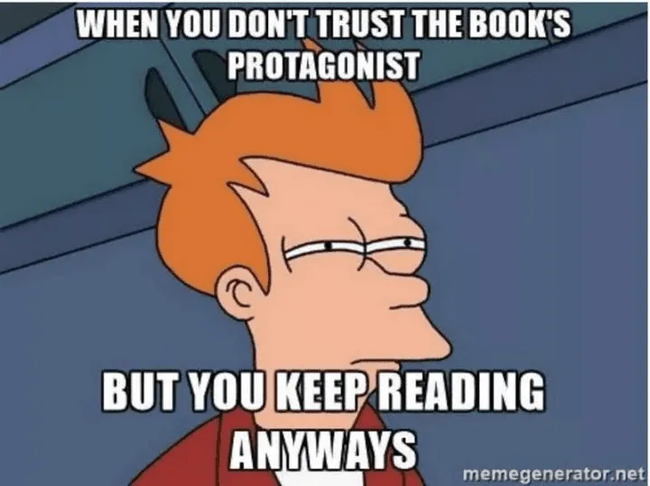

- People who don't understand this joke: 
    
    - Justin
    
    - Skyler

- “I love my eReader. It lets me buy books instantly, which is fantastic… until I wake up to a credit card statement that looks like I funded a small library.”
- "My toddler may not understand the magic of eBooks, but at least they can't rip the pages out! E-readers are great for avoiding book destruction, but they lack the charm of a toddler’s giggle when they reach the ‘end’ and demand another story."
- "Paperbacks are perfect for snuggling up and flipping through together—unless your toddler wants to 'help' and rips every page out. But eBooks?
- "If you touch that e-reader, you'll trigger an existential crisis—it's already trying to decide if it's a book or a screen."
- 
- "Let me just whip out my phone, open the camera, focus for 30 seconds, tap the notification, and—oh, look! A broken link. Truly revolutionary."  
  [google.com](google.com/404)
- “Oh, you want me to ‘gently fold’ the ingredients? Honey, I’m over here aggressively stirring like my life depends on it.”
- “Why does every recipe say ‘prep time: 10 minutes’ when it actually takes an hour, three emotional breakdowns, and a call to my mom?”
- “‘Season to taste’—so you mean dump in an unreasonable amount of garlic and pray for the best?”
- “Step one: gather ingredients. Step two: realize you’re missing half of them. Step three: improvise and hope it’s still edible.”
- “Oh, this recipe serves six? Cute. I’ll be eating the whole thing myself in one sitting, thanks.”
- The age-old battle between eReaders and physical books rages on, with book lovers divided into two camps: the tech-savvy minimalists who swear by their digital libraries and the old-school romantics who clutch their paperbacks like life rafts. Both sides have their merits, but let’s be honest—each has its quirks, too.

First off, eReaders are the ultimate space-savers. Why lug around a suitcase full of books when you can carry an entire library in a device thinner than a slice of toast? With an E Ink eReader, Kobo, or Nook, you can store thousands of books—most of which you’ll never read but will feel intellectually superior just having them there. Plus, they come with nifty features like adjustable fonts (because, let’s face it, some of us are getting old), built-in dictionaries (so you can pretend you always knew that word), and backlit screens that let you read in the dark without a flashlight wedged under your chin like it’s a 90s sleepover.

Then there’s accessibility. eReaders are a godsend for anyone who struggles with tiny print or prefers their books in audiobook form (because reading with your ears totally counts). You can download a book in seconds, skipping the hassle of human interaction at a bookstore. Living in the middle of nowhere? No problem—just click, and boom, instant book. It’s practically magic, except instead of a wand, you get a device that occasionally freezes at the worst possible moment.

But despite all these perks, some die-hard readers refuse to betray their beloved paperbacks. Why? Because books have *soul* (or at least, that’s what they say). There’s something about the smell of a freshly printed book, the feel of flipping actual pages, and the satisfaction of slamming a book shut after a particularly dramatic chapter. And let’s not forget the undeniable joy of hoarding books like a literary dragon, filling shelves with unread treasures just for the aesthetic—because nothing screams “I am a well-read intellectual” like an untouched collection of classics.

Physical books also come with a crucial survival advantage: they never run out of battery. Your E Ink eReader might abandon you mid-sentence if you forget to charge it, but a good old-fashioned book is always ready to go. They don’t need software updates, don’t crash, and won’t suddenly delete your collection because of some obscure digital rights policy that makes you question your life choices. Plus, try dropping a paperback—worst case, you bend a corner. Drop your eReader, and suddenly you’re out a couple hundred bucks, frantically Googling “how to fix a shattered screen” while questioning your entire existence.

And let’s talk about cost. Sure, an eReader is an investment, and eBooks are often cheaper than physical copies. But then you start impulse-buying books at 2 AM because digital purchases feel less real, and before you know it, your credit card bill is judging you harder than a disappointed librarian. Meanwhile, physical books can be borrowed, swapped, or purchased second-hand for the price of a coffee. Who’s the real winner here? (Spoiler: probably your local library, which you should visit once in a while.)

At the end of the day, whether you swear by your eReader or clutch your hardcovers like a lifeline, reading is what matters. Some of us embrace technology; others prefer the old-school charm of ink and paper. And then there are the truly unhinged ones—those who happily use both. Monsters.

- Oh, honey, scanning random QR codes like it’s a shortcut to heaven? Bless your heart. That’s about as smart as licking a frozen flagpole in the dead of winter.  You might as well hand over your phone, your bank info, and the deed to your grandma’s house while you’re at it. These little pixel traps can lead you straight into a mess bigger than Aunt Carol’s third divorce—malware, stolen passwords, or worse, your phone spillin’ all your business faster than the church ladies at Sunday brunch.  

Now, let’s get one thing clear—not every QR code is your friend. Just ‘cause it’s slapped on a flyer, taped to a gas pump, or stuck on some random street pole doesn’t mean it’s safe. Hackers are slicker than butter on a hot biscuit, and they love trickin’ folks into scanin’ codes that hijack your info faster than your cousin Jimmy borrows money he ain’t never gonna pay back. And don’t get me started on them fake payment codes—one bad scan, and your cash is gone quicker than a plate of biscuits at a family reunion.  

Be smart, darlin’. If you absolutely must scan a QR code, at least act like you got some sense. Check the source, don’t scan nothin’ from a sketchy piece of paper taped to a wall, and for the love of all things holy, use your phone’s security settings. And if some shady-lookin’ sign tells you you’ve won a *free iPhone* just by scanin’ a QR code, you best take a step back and ask yourself—when’s the last time Apple handed out free iPhones like they’re samples at Costco? That’s right, never.  

So next time a random QR code is callin’ your name, don’t just scan it like it’s a golden ticket to the good life. If you wouldn’t give your Social Security number to a man in a van sellin’ "discount" car insurance, then don’t go tappin’ every code you see like it’s a button at the honky-tonk jukebox. Your cybersecurity—and your common sense—deserve better.

-   
    
    
    
    
    
    
    
   
- 
